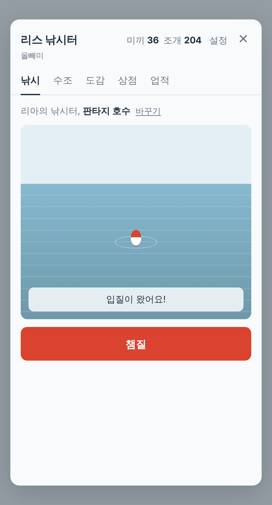
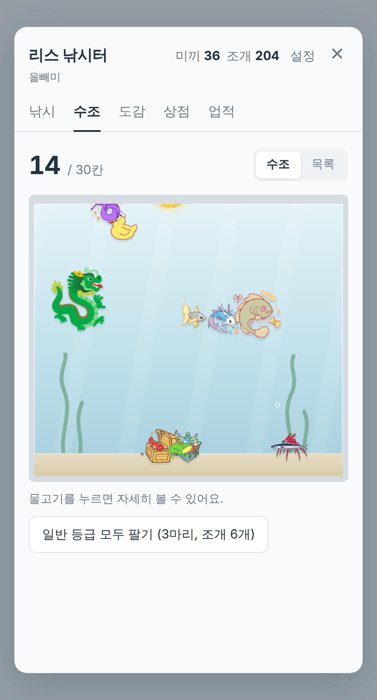
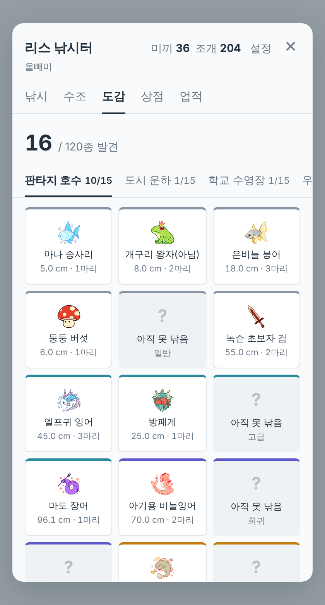

# 🎣 리스 낚시터

RisuAI에서 AI 답변을 받을 때마다 미끼가 쌓이고, 채팅 메뉴의 버튼 하나로 **지금 대화 중인 캐릭터의 세계관에 맞는 낚시터**에서 물고기를 낚는 플러그인입니다.

판타지 캐릭터와 놀면 판타지 호수에서 "마나 송사리"가, 현대물 캐릭터와 놀면 도시 운하에서 "누군가의 사원증"이 걸립니다. 한 캐릭터와 오래 낚시하면 그 캐릭터만의 고유종이 생기고, 낚은 물고기는 수조에서 헤엄칩니다.

| 낚시 | 수조 | 도감 |
|---|---|---|
|  |  |  |

## 주요 기능

- **사용량이 곧 재화**: 메인 답변과 보조 모델(번역·메모리·감정·기타 보조) 응답 1회마다 미끼 1개
- **캐릭터별 낚시터**: 캐릭터 설명을 읽어 8개 지역 중 하나를 자동으로 배정
- **공용 도감 120종**: 지역마다 15종 (일반 6, 고급 4, 희귀 3, 전설 2)
- **릴 감기 미니게임**: 희귀·전설 등급은 줄 장력을 조절하며 끌어올려야 잡힘
- **캐릭터 고유종**: 한 캐릭터와 10·50·150번 낚시하면, 보조 모델이 그 캐릭터만의 물고기를 한 단계씩 만듦
- **관상용 수조**: 낚은 물고기가 종류에 따라 헤엄치거나, 바닥을 기거나, 수면에 떠다님
- **업적 22개와 칭호**: 그중 3개는 조건이 숨겨져 있음
- **조개와 상점**: 물고기를 팔아 낚싯대, 떡밥, 수조 확장, 칭호를 구매
- **어탁 이미지**: 낚은 물고기를 기록 카드 PNG로 저장
- **하나로 이어지는 세계**: 캐릭터나 채팅방이 바뀌어도 미끼, 도감, 수조가 그대로 이어지고 기기 간에도 동기화됨

## 설치

1. 이 저장소의 [`risu_fishing.js`](risu_fishing.js)를 내려받습니다.
2. RisuAI → 설정 → 플러그인 → **플러그인 가져오기**에서 파일을 선택합니다.
3. 처음 불러올 때 뜨는 **권한 요청을 허용**합니다. 거절하면 미끼가 쌓이지 않습니다. 기본 미끼 5개로 낚시는 할 수 있습니다.

RisuAI 플러그인 API 3.0을 지원하는 버전이 필요합니다.

## 여는 법

| 위치 | 열리는 화면 |
|---|---|
| 채팅 입력창 왼쪽 ☰ 메뉴 → **낚시하기** | 낚시 |
| 설정 → 플러그인 섹션 → **🎣 리스 낚시터** | 낚시 |
| 사이드바 → **📖 낚시 도감** | 도감 |

창이 닫혀 있을 때 업적을 달성하면, 채팅 메뉴 버튼 이름이 "낚시하기 (새 업적 1)"로 바뀝니다.

## 낚시하기

1. **던지기**를 누르면 미끼 1개를 씁니다.
2. 찌를 지켜보다가 **찌가 크게 가라앉으면** 챔질합니다. 물 화면 아무 데나 눌러도 됩니다.
   - 찌가 살짝 흔들리는 건 가짜 입질입니다. 이때 챔질하면 물고기가 도망갑니다.
   - 챔질이 늦어도 놓칩니다. 등급이 높을수록 챔질할 수 있는 시간이 짧습니다.
3. **희귀·전설**은 이어서 릴을 감아야 합니다. 누르고 있으면 장력이 오르고, 떼면 내려갑니다. 바늘을 초록 구간에 두면 진행 막대가 차고, 다 차면 잡힙니다.
   - 장력이 끝까지 오르면 줄이 끊어집니다.
   - 줄을 너무 오래 느슨하게 두면 물고기가 빠져나갑니다.
4. 결과 카드에서 **수조에 넣기 / 팔기 / 어탁 이미지 저장** 중에서 고릅니다.

### 등급 확률

| 등급 | 확률 | 챔질 판정 시간 |
|---|---|---|
| 일반 | 60% | 0.80초 |
| 고급 | 25% | 0.65초 |
| 희귀 | 10% | 0.50초 (+ 릴 감기) |
| 전설 | 4% | 0.35초 (+ 릴 감기) |
| 🌀 이세계 | 1% | 다른 지역의 물고기가 걸림 |
| ✨ 황금 개체 | 1/256 | 등급과 별개, 판매가 5배 |

## 지역

캐릭터의 이름, 설명, 성격, 태그에서 키워드를 세어 가장 많이 걸린 지역을 배정합니다. 키워드가 하나도 없으면 도시 운하로 갑니다.

| 지역 | 이런 캐릭터 |
|---|---|
| 판타지 호수 | 마법, 왕국, 기사, 엘프, 드래곤 |
| 도시 운하 | 현대물, 회사, 재벌, 아이돌, 마피아, 경찰 |
| 학교 수영장 | 학교, 선후배, 동아리, 대학 |
| 우주 성운 | 우주, 함선, 로봇, 안드로이드, 사이버펑크 |
| 무협 계곡 | 무림, 문파, 사극, 조선, 요괴 |
| 심해 | 바다, 해적, 항해, 인어 |
| 폐허 늪 | 좀비, 아포칼립스, 호러, 뱀파이어 |
| 꿈속 연못 | 일상, 힐링, 동물, 동화, 디저트 |

배정이 마음에 들지 않으면 낚시 화면의 **바꾸기**에서 지역 이동권 1장을 쓰고 바꿀 수 있습니다. 처음에 1장을 기본으로 줍니다.

## 캐릭터 고유종

| 단계 | 생기는 시점 (그 캐릭터와 던진 횟수) | 걸릴 확률 |
|---|---|---|
| 1단계 | 10번 | 던질 때마다 2% |
| 2단계 | 50번 | 1.5% |
| 3단계 | 150번 | 1% |

- 고유종을 만들 때 **보조 모델(기타 보조, 실패하면 서브 모델)을 한 번 호출**합니다. 캐릭터 이름, 설명(앞 1,500자), 성격(앞 300자)을 보내고, 짧은 JSON 응답을 받습니다.
- 생성에 실패하면 5번 더 던진 뒤 다시 시도합니다.
- 낚은 고유종에는 **직접 그림을 넣을 수 있습니다.** 도감 → 고유종 탭에서 넣으며, 192px로 줄여 저장합니다.
- **다시 만들기권**(상점)으로 새 고유종을 만들 수 있습니다. 예전 고유종은 낚은 기록과 함께 "이전 고유종"으로 남습니다.

## 조개와 상점

조개는 물고기를 팔거나 업적을 달성하면 생깁니다. 업적 하나에 20개, 숨겨진 업적은 50개입니다.

물고기 판매가는 등급 기본가(2 / 5 / 15 / 50)에 다음 배수를 곱한 값입니다.
- 크기에 따라 0.8~1.2배
- 황금 개체 5배
- 이세계 물고기 1.5배
- 고유종 2~4배

| 상품 | 가격 | 효과 |
|---|---|---|
| 낚싯대 (3단계) | 50 / 150 / 400 | 챔질 판정 시간 +10/20/30%, 릴 초록 구간 확장 |
| 떡밥 | 30 | 5번 던지는 동안 희귀·전설 확률 1.5배 |
| 지역 이동권 | 20 | 캐릭터의 낚시터 지역 변경 |
| 고유종 다시 만들기권 | 80 | 고유종 새로 만들기 |
| 수조 확장 | 40부터 | 10칸씩 늘어나고, 최대 100칸 |
| 칭호 | 100 / 250 / 600 | 조개 수집가, 물고기 박사, 낚시 귀족 |

## 업적

업적 탭에서 이름과 힌트를 볼 수 있습니다. 달성하면 조건과 칭호가 공개되고, 칭호 하나를 장착하면 창 제목 아래에 표시됩니다.

첫 손맛, 월척, 놓친 고기가 크다, 그물 장인, 차원 낚시꾼, 반짝이는 것, 헛손질, 손목 단련, 통역사의 손목, 기억의 정원사, 감정 해독가, 미끼 부자, 올빼미, 장기 연애, 대하소설, 첫 장사, 큰손, 나만의 물고기, 낚시터의 주인, 그리고 숨겨진 업적 3개가 있습니다.

## 물고기 이미지 바꾸기

기본은 이모지이고, 그림을 준비하면 바꿀 수 있습니다.

1. [`fish_image_list.csv`](fish_image_list.csv)에 120종의 파일 이름, 지역, 등급, 이모지, 이름, 설명이 정리되어 있습니다. 파일 이름은 `fantasy_01.png`부터 `dream_15.png` 형식입니다.
2. 그림을 그 이름 그대로 한 폴더에 올립니다. 예를 들면 이 저장소의 `fish/` 폴더입니다.
3. RisuAI 플러그인 설정의 **image_base**에 그 폴더 주소를 넣습니다.
   ```
   https://raw.githubusercontent.com/<아이디>/<저장소>/main/fish
   ```

알아둘 점:
- 일부만 준비해도 됩니다. 없는 그림은 자동으로 이모지가 나옵니다.
- 수조에서 방향 전환이 자연스럽도록 **왼쪽을 보는 그림**으로 그려 주세요. 배경이 투명한 정사각형 PNG(256×256 정도)를 권장합니다.
- 어탁 이미지에도 그림을 넣으려면, 그림 서버가 다른 사이트에서 이미지를 가져가도록 허용(CORS)해야 합니다. GitHub raw 주소는 이 조건을 만족합니다.

## 데이터와 백업

- 모든 기록은 RisuAI의 플러그인 저장소(`pluginStorage`)에 저장되어, 세이브 파일을 따라 기기 간에 동기화됩니다.
- 설정 → 백업에서 **파일로 저장 / 파일에서 불러오기**(JSON)를 할 수 있습니다.
- 외부로 나가는 데이터는 고유종을 만들 때 사용자가 설정한 보조 모델로 보내는 캐릭터 정보뿐입니다. 이 플러그인이 따로 서버에 보내는 것은 없습니다.

## 알려진 제한

- 보조 모델 응답을 스트리밍으로 받도록 설정했다면, 그 호출은 미끼로 집계되지 않을 수 있습니다.
- 답변을 다시 생성(리롤)해도 미끼가 1개 생깁니다.
- 그룹 채팅은 캐릭터 설명을 읽지 않고 도시 운하로 배정됩니다.
